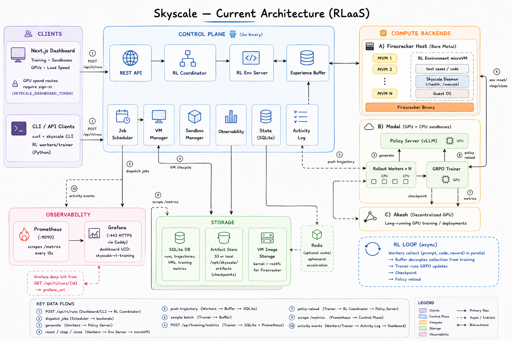

# Skyscale

**Reinforcement Learning as a Service.** Post-train any LLM on any task using distributed async RL — without managing clusters, scheduling workers, or provisioning GPUs. One API call starts the whole pipeline.

> **Currently supports:** distributed GRPO RL runs (`POST /api/rl/runs`) with Modal GPU sandboxes (vLLM policy server, CPU rollout workers, GRPO trainer), Firecracker microVMs as code-execution RL environments (`reset` / `step` / `close`), an async experience buffer, live metrics in the Next.js dashboard, and Prometheus + Grafana observability. Also: Firecracker sandboxes, Railway-backed container sandboxes, on-demand GPU job submission (Modal / Akash / HuggingFace), and sign-in-gated GPU spend when `SKYSCALE_DASHBOARD_TOKEN` is set.
>
> **Not yet:** closed-loop policy weight hot-swap on Modal, multi-turn episodes, custom problem-set uploads, and permissionless workers. See [What's not built yet](#whats-not-built-yet).

---

## What is Skyscale?

Skyscale is an **RLaaS platform**: you bring a base model and a task; Skyscale orchestrates the entire post-training loop across heterogeneous compute. Rollout workers collect experience in parallel on cheap CPU, a policy server serves the live model on GPU, and a trainer continuously updates weights using GRPO — all coordinated by a single control plane you deploy once.

The core insight is that **isolated code execution sandboxes are RL environments**. Every Firecracker microVM is a `step()` function: the agent submits code, the VM executes it against test cases, and the pass rate becomes the reward. No reward model to train. No human labelers. Ground-truth execution feedback at scale.

This follows the architecture of distributed async RL systems like Echo-2 and INTELLECT-2 — cheap workers collecting trajectories asynchronously, decoupled from a GPU trainer consuming them in batches — but exposes the whole thing as a managed service behind a REST API.

```
One API call:  POST /api/rl/runs  { base_model, num_workers, gpu_model }

                        │
                        ▼
              ┌─────────────────────┐
              │    RL Coordinator   │
              └──────────┬──────────┘
                         │  spawns
          ┌──────────────┼──────────────┐
          ▼              ▼              ▼
   Policy Server    N × Workers     Trainer
   (vLLM, GPU)      (CPU, async)    (GRPO, GPU)
          │              │              │
          │   generate   │   execute    │   update
          └──────────────┴──────────────┘
                    Experience Buffer
                    (trajectories DB)
```

Workers continuously pull problems, generate code via the policy server, execute in isolated VMs, and push `(prompt, code, reward)` trajectories to the buffer. The trainer samples batches and runs policy gradient updates. The loop runs until you stop it or hit a step budget.

---

## Core concepts

### The RL Environment

Every coding problem is a Gym-like episode. The environment API is three HTTP calls:

```
POST /api/rl/env/reset   →  { sandbox_id, problem_id, prompt, test_cases }
POST /api/rl/env/step    →  { reward, passed_tests, total_tests, stdout, stderr }
POST /api/rl/env/close   →  204
```

`reset` spins up a fresh Firecracker microVM and samples a problem. `step` uploads the generated code, executes it against test cases inside the VM, and returns a reward between 0 and 1. `close` destroys the VM. Each episode is fully isolated — no shared state between workers, no sandbox reuse.

**Reward function:**
```
reward = passed_tests / total_tests
       − 0.0001 × max(0, len(code) − 500)   # discourages bloated solutions
```

### The Experience Buffer

A central store of trajectories decouples data collection from training. Workers push at their own rate; the trainer samples batches independently. This async design means you can scale workers and trainer independently — add more workers to collect faster, upgrade to a bigger GPU for faster updates, without touching anything else.

```
POST /api/rl/buffer/push    { run_id, prompt, code, reward, done }
POST /api/rl/buffer/sample  { run_id, batch_size }  →  [ trajectory, ... ]
GET  /api/rl/buffer/stats   ?run_id=<id>            →  { size }
```

### The Policy Server

A vLLM inference server running the current model weights, served on GPU. Workers call the standard OpenAI-compatible `/v1/chat/completions` endpoint. When the trainer saves a checkpoint, it signals the policy server to hot-swap weights — so workers are always generating from the latest policy without restarts.

### The GRPO Trainer

Group Relative Policy Optimization (GRPO) — the same algorithm used by DeepSeek-R1 — runs on GPU, reading batches from the buffer and computing policy gradient updates. Group relative advantage normalizes rewards within each batch, which is stable and doesn't require a separate value network.

### The Coordinator

`POST /api/rl/runs` is the single entry point. It spawns the policy server, trainer, and N rollout workers as GPU/CPU jobs on Modal (or Akash), records the run, and starts streaming metrics. `GET /api/rl/runs/{id}` returns live status, per-worker health, buffer size, metrics history, pipeline stage, and an optional `grafana_url`.

**Activity log:** workers, trainer, and control plane emit structured events via `POST /api/rl/runs/{id}/events`. The dashboard streams these in the run detail **Logs** and **Events** tabs.

**Policy reload:** after a checkpoint, the trainer calls `POST /api/rl/runs/{id}/policy-reload` to signal the policy server to load new weights from the artifact store.

---

## Quick start

### 1. Deploy the control plane

The control plane is a single Go binary. Build and run it on any Linux server with Firecracker installed:

```bash
cd control-plane
CGO_ENABLED=0 GOOS=linux GOARCH=amd64 go build -o skyscale-cp .
./skyscale-cp
```

Or use the pre-built binary:

```bash
# On your server (Linux, x86_64)
curl -O https://github.com/Shubham-Rasal/skyscale/releases/latest/download/skyscale-cp
chmod +x skyscale-cp && ./skyscale-cp
```

Required env:
```env
PORT=8080
MODAL_TOKEN_ID=<your-modal-token-id>
MODAL_TOKEN_SECRET=<your-modal-token-secret>
MODAL_PYTHON=/path/to/modal-venv/bin/python3
MODAL_DISPATCH_SCRIPT=/opt/skyscale/control-plane/modal/dispatch.py
HF_TOKEN=<your-huggingface-token>
GPU_PROVIDER_ORDER=modal,huggingface,akash
```

VM assets (kernel + rootfs) are downloaded automatically to `/opt/skyscale/vm/` on first sandbox creation. Override with `FAAS_VM_KERNEL_PATH` and `FAAS_VM_ROOTFS_PATH`.

### 2. Start an RL run

```bash
curl -X POST http://your-server:8080/api/rl/runs \
  -H "Content-Type: application/json" \
  -d '{
    "base_model":   "Qwen/Qwen3-0.6B",
    "num_workers":  4,
    "gpu_model":    "a10g"
  }'
```

Response:
```json
{
  "run_id":  "rl-a3f91c2b",
  "status":  "starting"
}
```

The control plane immediately starts provisioning: a vLLM policy server on a GPU, rollout workers on CPU, and a GRPO trainer on GPU. Workers are **deferred until the policy server URL is registered** — the job queue won't dispatch rollouts until vLLM is healthy and reachable.

### 3. Watch it train

**Dashboard** (recommended):

```bash
cd dashboard && npm install && npm run dev
open http://localhost:3000/
```

The Training page shows live RL runs with reward/loss charts, per-run activity logs, buffer size, policy URL, and a Grafana deep link when configured. Account settings live in the sidebar profile menu.

**API polling:**

```bash
curl http://your-server:8080/api/rl/runs/rl-a3f91c2b
```

**Observability stack** (Prometheus + Grafana):

```bash
docker compose -f docker-compose.observability.yml up -d
```

- Grafana (local): http://localhost:3001 (login `admin` / `admin`)
- Prometheus: http://localhost:9090
- Dashboard UID: `skyscale-rl-training`

For production HTTPS, Caddy in the compose file terminates TLS on port 443. Edit `observability/caddy/Caddyfile` for your domain, then set on the control plane:

```env
GRAFANA_BASE_URL=https://your-domain.example
GRAFANA_RL_DASHBOARD_UID=skyscale-rl-training
GRAFANA_ORG_ID=1
```

When configured, `GET /api/rl/runs/{id}` includes a `grafana_url` field and the run detail panel links to Grafana filtered by run ID. The control plane also exports Prometheus metrics at `GET /metrics`. See [docs/observability.md](docs/observability.md) for the full metric list.

### 4. Stop when done

```bash
curl -X DELETE http://your-server:8080/api/rl/runs/rl-a3f91c2b
```

Checkpoints are saved to the artifact store at each `CHECKPOINT_EVERY` step. When S3 is not configured, uploads fall back to `ARTIFACT_LOCAL_DIR` (default `/opt/skyscale/artifacts`).

---

## Dashboard

The Next.js dashboard (`dashboard/`) is the primary operator UI:

| Page | Path | Description |
|------|------|-------------|
| **Training** | `/` | RL runs list, live reward/loss charts, run detail drawer (logs, metadata, events), start/stop runs |
| **Templates** | `/templates` | Job templates for quick submission |
| **Sandboxes** | `/faas` | Deploy and manage isolated container sandboxes (Railway-backed) |
| **On-Demand GPUs** | `/gpus` | GPU inventory and job queue |
| **Load Speed** | `/benchmarks` | FaaS cold-start and throughput benchmarks |

RL run detail includes stage, policy URL, buffer size, worker/trainer status, in-app Recharts metrics, activity log streaming, and an optional Grafana link.

**GPU spend protection:** starting RL runs, submitting GPU training jobs, and invoking GPU functions require a signed-in session when `SKYSCALE_DASHBOARD_TOKEN` is set on both the dashboard and control plane. Local dev works without it. See [Configuration reference](#configuration-reference).

```bash
cd dashboard
cp env.example .env.local   # set DATABASE_URL, BETTER_AUTH_SECRET, SKYSCALE_DASHBOARD_TOKEN
npm install && npm run dev
```

## End-to-end pipeline test

`scripts/modal_pipeline_test.py` verifies the full pipeline end-to-end using Modal for GPU/CPU sandboxes:

```bash
pip install modal requests
HF_TOKEN=<token> python3 scripts/modal_pipeline_test.py
```

It runs through all four stages — policy server health, RL run creation, buffer fill from 2 workers, and 3 GRPO training steps — and prints a pass/fail report with final metrics.

**Load testing sandboxes:**

```bash
k6 run perf/faas_load_test.js
```

Set `API_URL` to your control plane origin. See `perf/faas_load_test.js` for VUs and duration defaults.

---

## API reference

### RL Runs

| Method | Endpoint | Description |
|--------|----------|-------------|
| `POST` | `/api/rl/runs` | Start a distributed RL run — spawns policy server, trainer, N workers (sign-in gated when `SKYSCALE_DASHBOARD_TOKEN` is set) |
| `GET` | `/api/rl/runs` | List all runs |
| `GET` | `/api/rl/runs/{id}` | Run status, worker health, buffer size, metrics history, stage, `grafana_url` |
| `DELETE` | `/api/rl/runs/{id}` | Stop run and terminate all child jobs (sign-in gated) |
| `POST` | `/api/rl/runs/{id}/policy-server` | Register policy server URL (called by Modal dispatch) |
| `POST` | `/api/rl/runs/{id}/policy-reload` | Trigger policy server weight reload from artifact store |
| `GET` | `/api/rl/runs/{id}/events` | List activity log events for a run |
| `POST` | `/api/rl/runs/{id}/events` | Append an activity log event (workers/trainer) |

### RL Environment

| Method | Endpoint | Description |
|--------|----------|-------------|
| `POST` | `/api/rl/env/reset` | Allocate a Firecracker VM + sample a problem |
| `POST` | `/api/rl/env/step` | Execute code in VM, return reward and test results |
| `POST` | `/api/rl/env/close` | Destroy VM |
| `GET` | `/api/rl/env/problems` | List available problems |

### Experience Buffer

| Method | Endpoint | Description |
|--------|----------|-------------|
| `POST` | `/api/rl/buffer/push` | Push a trajectory `{ run_id, prompt, code, reward, done }` |
| `POST` | `/api/rl/buffer/sample` | Dequeue a batch of unconsumed trajectories |
| `GET` | `/api/rl/buffer/stats` | Buffer size for a run |

### Training Jobs (GPU)

| Method | Endpoint | Description |
|--------|----------|-------------|
| `POST` | `/api/training/jobs` | Submit a GPU job (trainer, policy server, or custom) |
| `GET` | `/api/training/jobs` | List jobs |
| `GET` | `/api/training/jobs/{id}` | Job status and logs |
| `POST` | `/api/training/metrics` | Report training metrics from a running job |

### Observability

| Method | Endpoint | Description |
|--------|----------|-------------|
| `GET` | `/metrics` | Prometheus metrics (`skyscale_training_*`, `skyscale_rl_*`, `skyscale_job_*`) |

### Sandboxes (direct access)

| Method | Endpoint | Description |
|--------|----------|-------------|
| `POST` | `/api/sandboxes` | Create a persistent sandbox VM |
| `POST` | `/api/sandboxes/{id}/exec` | Execute code synchronously |
| `POST` | `/api/sandboxes/{id}/files/{path}` | Upload a file |
| `GET` | `/api/sandboxes/{id}/files/{path}` | Download a file |
| `DELETE` | `/api/sandboxes/{id}` | Destroy sandbox |

---

## Architecture

### Current (RLaaS)



The diagram above shows the full system: clients (dashboard + CLI) hit the Go control plane, which coordinates RL runs across **Modal** (policy server, rollout workers, GRPO trainer), **Firecracker** (RL environment microVMs and sandboxes), and optionally **Akash** (long-running GPU jobs). SQLite stores runs and trajectories; Prometheus/Grafana scrape `/metrics` for historical dashboards.

**Compute backends**

- **Firecracker microVMs** — hardware-isolated sandboxes for RL environment episodes and code execution. Each VM boots Alpine Linux with the Skyscale daemon in ~1s, runs code, and is destroyed after the episode.
- **Modal** — on-demand GPU sandboxes for the policy server (vLLM) and GRPO trainer. Billed per second; no idle cost between runs.
- **Akash** — decentralized GPU marketplace for longer-running training jobs and deployments.

**Inside each Firecracker VM**

The rootfs is a custom Alpine Linux image (`scripts/build_daemon_rootfs.sh`) with the Skyscale daemon compiled in. The daemon auto-starts via OpenRC at boot, listens on `:8081`, and handles code execution, file I/O, and health checks. VM assets are downloaded automatically on first use:

| Asset | Path |
|-------|------|
| Kernel | `/opt/skyscale/vm/vmlinux-5.10.225` |
| Rootfs | `/opt/skyscale/vm/rootfs.ext4` |

### Legacy (FaaS-only)

The original architecture predates RLaaS — a serverless function platform with a pre-warmed Firecracker pool, Function Registry, and Redis-backed state:


This design focused on `skyscale deploy` / `skyscale invoke` with a warm VM pool and in-VM Python execution. The current platform extends the same Firecracker + daemon foundation with distributed RL training, heterogeneous GPU providers, and a web dashboard.

---

## Key source files

| Path | What it does |
|------|-------------|
| `control-plane/api/rl.go` | RL coordinator — start/stop/status for distributed runs |
| `control-plane/api/rl_events.go` | RL activity log HTTP handlers |
| `control-plane/api/rl_env.go` | RL environment server — Gym-style reset/step/close, problem dataset |
| `control-plane/api/rl_buffer.go` | Experience buffer — trajectory storage, batch sampling |
| `control-plane/observability/metrics.go` | Prometheus gauges/counters + Grafana deep links |
| `control-plane/auth/spend.go` | GPU spend auth middleware (`SKYSCALE_DASHBOARD_TOKEN`) |
| `control-plane/rlevents/log.go` | In-memory RL activity event store |
| `control-plane/state/state.go` | `Trajectory`, `RLRun`, `VM`, `Execution` DB models |
| `control-plane/vm/config.go` | VM asset resolution with auto-download fallback |
| `control-plane/modal/dispatch.py` | Modal sandbox dispatch — policy server, workers, trainer |
| `training/rl-worker/worker.py` | Rollout worker — the async data collection loop |
| `training/rl-trainer/trainer.py` | GRPO trainer — gradient updates, checkpoint saving |
| `training/policy-server/serve.py` | vLLM policy server with weight hot-swap |
| `dashboard/components/training/` | RL dashboard — runs table, charts, run detail panel |
| `observability/` | Prometheus config, Grafana dashboards, Caddy TLS proxy |
| `scripts/modal_pipeline_test.py` | End-to-end pipeline test |
| `perf/faas_load_test.js` | k6 load test for FaaS sandboxes |
| `scripts/build_daemon_rootfs.sh` | Build Alpine rootfs with daemon binary |
| `cmd/daemon/daemon.go` | In-VM daemon — code execution, file I/O, health |

---

## Project structure

```
.
├── control-plane/
│   ├── api/
│   │   ├── rl.go               # RL coordinator
│   │   ├── rl_env.go           # RL environment (reset/step/close)
│   │   ├── rl_buffer.go        # Experience buffer
│   │   ├── rl_events.go        # Activity log HTTP handlers
│   │   └── ...                 # FaaS, sandbox, deployment, training handlers
│   ├── rlevents/               # In-memory RL activity log
│   ├── observability/          # Prometheus metrics + Grafana URL builder
│   ├── auth/spend.go           # GPU spend auth middleware
│   ├── modal/                  # Modal GPU provider client
│   ├── scheduler/              # Job dispatch (Modal, Akash, HuggingFace)
│   ├── state/                  # SQLite models
│   └── vm/                     # Firecracker VM lifecycle
├── training/
│   ├── rl-worker/              # Rollout worker (Python)
│   ├── rl-trainer/             # GRPO trainer (Python)
│   └── policy-server/          # vLLM policy server (Python)
├── dashboard/                  # Next.js dashboard (RL training, sandboxes, benchmarks)
├── observability/
│   ├── prometheus/             # Scrape config for control plane /metrics
│   ├── grafana/                # Provisioned RL training dashboard
│   └── caddy/                  # HTTPS reverse proxy for Grafana (production)
├── docker-compose.observability.yml
├── perf/
│   └── faas_load_test.js       # k6 load test for sandboxes
├── cmd/
│   ├── daemon/                 # In-VM daemon (Go)
│   └── cli/                    # CLI tool
├── sdk/python/                 # Sandbox + App SDK
├── scripts/
│   ├── modal_pipeline_test.py  # End-to-end test
│   └── build_daemon_rootfs.sh  # Build VM rootfs
└── tests/e2e/                  # Integration tests
```

---

## Configuration reference

| Variable | Description |
|----------|-------------|
| `PORT` | Control plane HTTP port (default `8080`) |
| `MODAL_TOKEN_ID` | Modal API token ID |
| `MODAL_TOKEN_SECRET` | Modal API token secret |
| `MODAL_PYTHON` | Path to Python with Modal SDK (e.g. venv) |
| `MODAL_DISPATCH_SCRIPT` | Path to `control-plane/modal/dispatch.py` |
| `GPU_PROVIDER_ORDER` | Comma-separated provider preference (e.g. `modal,huggingface,akash`) |
| `HF_TOKEN` | HuggingFace token for model downloads |
| `ARTIFACT_LOCAL_DIR` | Local checkpoint fallback when S3 is not configured |
| `S3_ENDPOINT` / `S3_BUCKET` / `S3_ACCESS_KEY` / `S3_SECRET_KEY` | S3-compatible artifact store (optional) |
| `FAAS_VM_KERNEL_PATH` | Firecracker kernel path (auto-downloaded if absent) |
| `FAAS_VM_ROOTFS_PATH` | VM rootfs path (auto-downloaded if absent) |
| `FAAS_VM_MEMORY_MB` | Memory per VM in MB (default `128`) |
| `FAAS_VM_CPU_COUNT` | vCPUs per VM (default `1`) |
| `DB_PATH` | SQLite database path (default `skyscale.db`) |
| `SKYSCALE_PUBLIC_BASE` | Public origin for deployment URLs |
| `SKYSCALE_DASHBOARD_TOKEN` | Shared secret for sign-in-gated GPU spend routes (set on control plane **and** dashboard) |
| `NEXT_PUBLIC_API_URL` | Control-plane URL for the dashboard (browser) |
| `SKYSCALE_CONTROL_PLANE_URL` | Server-side proxy target for dashboard API routes |
| `GRAFANA_BASE_URL` | Grafana base URL for per-run deep links |
| `GRAFANA_RL_DASHBOARD_UID` | Grafana dashboard UID (default: `skyscale-rl-training`) |
| `GRAFANA_ORG_ID` | Optional Grafana org ID for deep links |
| `DATABASE_URL` | PostgreSQL connection string for auth |
| `BETTER_AUTH_SECRET` | Better Auth signing secret |

---

## What's not built yet

- **Closed-loop weight sync** — trainer checkpoints and policy reload hooks exist, but end-to-end weight hot-swap on Modal native vLLM is not fully wired. Rollouts may still use the frozen base model until reload is completed.
- **Multi-turn episodes** — workers run single-turn (one attempt per problem). Multi-turn (error → fix → retry) is the next step.
- **Custom problem sets** — problems are currently embedded in the control plane. A problem registry API (upload JSONL) is planned.
- **Weight broadcast** — policy server hot-swaps from the artifact store URL. Peer-assisted weight distribution (SHARDCAST-style) would reduce reload latency at scale.
- **Permissionless workers** — currently workers are trusted. TOPLOC-style verification for untrusted third-party contributors is future work.

---

## License

MIT — see LICENSE.

## Acknowledgements

- [Firecracker](https://github.com/firecracker-microvm/firecracker) — the microVM runtime powering every RL environment episode
- [Echo-2 / INTELLECT-2](https://gradient.network/blog/echo-2-unlocking-the-second-scaling-law) — the distributed async RL architecture this system is based on
- [DeepSeek-R1](https://arxiv.org/abs/2501.12948) — GRPO algorithm
- [vLLM](https://github.com/vllm-project/vllm) — policy server inference engine
- [Modal](https://modal.com) — on-demand GPU compute for policy server and trainer
